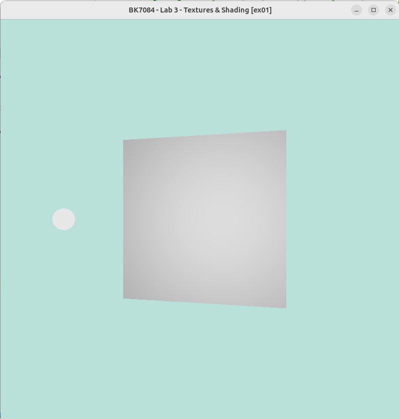
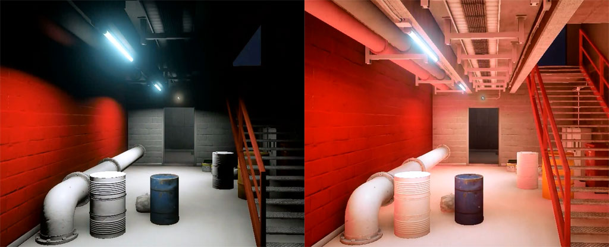
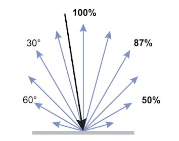
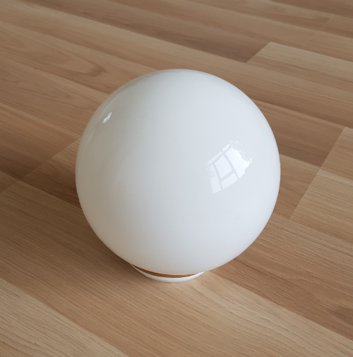
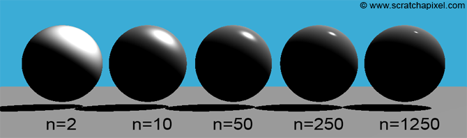

# Assignment 3

When you first run the program, you will see a white sphere and a grayish
plane Figure [1](#fig:blinn_phong_shading). The sphere represents light, and the plane is the object that you
will change the appearance of in this assignment.

Your task in this assignment is to understand how the material is influencing
the appearance of the object. You will do this by changing the material
properties of the object.

## Ambient lighting

When light hits an object, some of the light is absorbed and some is
reflected. The light that is reflected might hit another object and be
absorbed or reflected again. In this way, the light we see around us
might have bounced from object to object for quite a while before
reaching our eye. When light reaches our eye in such an indirect way, we
call it indirect lighting.  
  
In computer graphics simulating this kind of lighting is one of the
hardest things to get right, but simultaneously one of the most
important factors on a scene’s photo realism.  

Since it is so hard to approximate, old graphics applications used to
make it easy for themselves and just assume all objects are hit by some
constant amount of background light. This is a very crude approximation
and in no way photo-realistic, but it is better than nothing.

## Diffuse Reflection

Diffuse reflection, the reflection of light rays from a surface at many
different angles, is generally modelled in graphics as ideal diffuse
reflection. Ideal diffuse reflection means that the distribution of rays
reflecting off the diffuse material does so uniformly in all directions.
You can see a close approximations of such an ideal diffuse surface when
looking at a plaster wall, or a piece of chalk. Whatever angle you look
at these materials from, the amount of light they reflect seems to be
the same.  
  
In graphics we model this phenomenon with a model named the **Lambertian
Reflectance Model**. This model makes use of **Lambert’s cosine law** to
determine the amount of light reaching a viewer from an ideal diffuse
surface. Lambert’s law states that when looking at such an ideal diffuse
surface, the light intensity reaching your eye from the surface is
proportional to the cosine of the angle between the surface normal
vector and the direction vector from the surface to the light.

As you can see in the above image, the light is most intensely reflected
when the light direction matches up closely with the surface normal. The
bigger the angle between these two vectors, the less light is reflected.
This relationship can be described with the following function:  
  
$I_D = cos(\theta)$  
  
Where $I_D$ is the intensity of the light reflecting off the surface,
and $\theta$ is the angle between the light direction and the surface
normal.  
  
However, calculating angles and cosines on the graphics card is not a
very cheap operation. Luckily, we know that the dot product between two
vectors is defined as follows:  
  
$\mathbf{a} \cdot \mathbf{b} = \|\|\mathbf{a}\|\|\\:\|\|\mathbf{b}\|\|\\:\cos(\theta)$  
  
Where $a$ and $b$ are the two vectors, $\theta$ is the angle
between them and $||\mathbf{a}||$ is the length of the vector a.  
  
Now we can use this to reformulate our earlier equation:  
  
$I_D = \frac{\mathbf{L} \cdot \mathbf{N}}{\|\|\mathbf{L}\|\|\\:\|\|\mathbf{N}\|\|}$  
  
Since a vector divided by its length is just the normalized version of
that vector, we can assume our light and normal vector are normalized
and write the equation as:  
  
$I_D = \mathbf{\widehat{L}} \cdot \mathbf{\widehat{N}}$  
  
Where $L$ is the normalized vector from the surface to the light
source and $N$ is the surface normal vector.  
  
This is almost the equation for Lambertian Reflectance as well, but we
are not considering the color of the surface and the intensity of the
light yet. If we multiply these factors by the cosine law we obtain the
final equation:  
  
$I_D = \mathbf{\widehat{L}} \cdot \mathbf{\widehat{N}} C_S I_L$

## Specular Reflection

Specular reflection is the reflection of light rays in a mirror-like
fashion. The angle between the incoming light direction and the surface
normal is the same as the angle between the reflected light and the
surface normal. The result of this is that light originating from
somewhere else is reflected into your eye by this surface, making it act
like a mirror.  
  
Perfect specular reflectors are hard to find though. Mirrors definitely
come closest. Usually, materials reflect light in some combination of
diffuse and specular reflection. In the photo below, you see such a
situation. Usually the the object looks fairly diffuse, but has a bright
spot where the intense light is reflected specularly.  

In computer graphics, this phenomenon has many possible approximations.
The first one, of interest to you, was proposed by Bui Tuong Phong, and
is called Phong Reflection. It is a reflection model that tries to
approximate this bright spot you often get when a light source shines on
some shiny surface. The shinier the surface, the more intense and sharp
these specular highlights will be, the duller the surface, the more
gradually these highlights fade away.

The formula for Phong reflection is mostly empirical, but there is logic
to it. In order to get an intense reflection of light it tries to
minimize the angle difference between the direction from the surface to
the observer, and the perfectly reflected light direction. If these
match up closely, then the observer sees a lot of the light that follows
this perfect reflection direction. This relationship can be modelled
as:  
  
$I_S = \mathbf{\widehat{V}} \cdot \mathbf{\widehat{R}}$  
  
Where $I_S$ is the intensity of the specular light reaching the
observer, $\mathbf{\widehat{V}}$ is the normalized direction from the
surface to the observer and $\mathbf{\widehat{R}}$ is the perfect
reflection direction.  
  
The equation to calculate the perfect reflection direction is usually
stated in one of two ways, depending on if the light direction vector is
pointing towards the surface or toward the light.  
  
$\mathbf{R} = 2 \mathbf{N}(\mathbf{N} \cdot \mathbf{L}) - \mathbf{L}$  
  
Where $\mathbf{R}$ is the perfect reflection direction, $\mathbf{N}$
is the surface normal, $\mathbf{L}$ is the direction from the surface
to the light, and all of these vectors are normalized. If the vector
$\mathbf{L}$ is instead pointing towards the surface the equation
becomes:  
  
$\mathbf{R} = \mathbf{L} - 2 \mathbf{N}(\mathbf{N} \cdot \mathbf{L})$  
  
In order to make the specular highlight smaller and sharper the closer
the viewer is to the perfect reflection angle, Phong exaggerates the
earlier formula, by taking it to the power of some **shininess** factor
**n**.  
  
$I_S = (\mathbf{\widehat{V}} \cdot \mathbf{\widehat{R}})^n$  
  
Again we have to account for the color of the surface and the intensity
of the incoming light, and we arrive at the final formula:  
  
$I_S = (\mathbf{\widehat{V}} \cdot \mathbf{\widehat{R}})^n C_S I_L$

# Normal Mapping

Normal mapping is a technique that allows us to add more detail to a
surface without having to add more geometry. It does this by storing
additional information in a texture. This information is then used to
perturb the surface normal of the object. This perturbation is then used
in the lighting calculations to make the surface appear more detailed
than it actually is.

You can draw a normal map by hand, but it is usually easier to generate
them either from a high resolution model or from a height map or from 
a diffuse texture. The easiest way to generate a normal map is from a
texture. This can be done easily in a program like Photoshop or GIMP.

Here are some tutorials on how to do this:

- [prior to Photoshop CS6](https://dreamlight.com/how-to-create-normal-maps-from-photographs/#Photoshop)
- [Photoshop CS6 and later](https://www.mattrittman.com/create-normal-map-photoshop/)
- [Photopea](https://www.photopea.com/) (free online Photoshop clone, works in browser, the same as the previous tutorial)
- [GIMP](https://www.youtube.com/watch?v=iNN0xZeg_aQ)

# Exam practice

# Transformations

### 1\.

Create a translation matrix that will move a 3D point by (3, 5, -7).
Apply it to such a point to check your answer.

### 2\.

What type of transformation is the following matrix responsible for?
Sketch what it would do to our test subject.

$$
\begin{bmatrix}
1 & 0\\
0 & -1\\
\end{bmatrix}
$$

### 3\.

What type of transformation is the following matrix responsible for?
Sketch what it would do to our test subject.

$$
\begin{bmatrix}
1 & 2\\
0 & 1\\
\end{bmatrix}
$$

### 4\.

What type of transformation is the following matrix responsible for? On
which axis? Sketch what it would do to our test subject.

$$
\begin{bmatrix}
0.707 & -0.707 & 0\\
0.707 & 0.707 & 0\\
0 & 0 & 1\\
\end{bmatrix}
$$

### 5\.

We are drawing a 3D bunny on screen, but would like to make it twice as
big and rotate it by 180 degrees on the X-axis. Form a single matrix to
perform this operation.