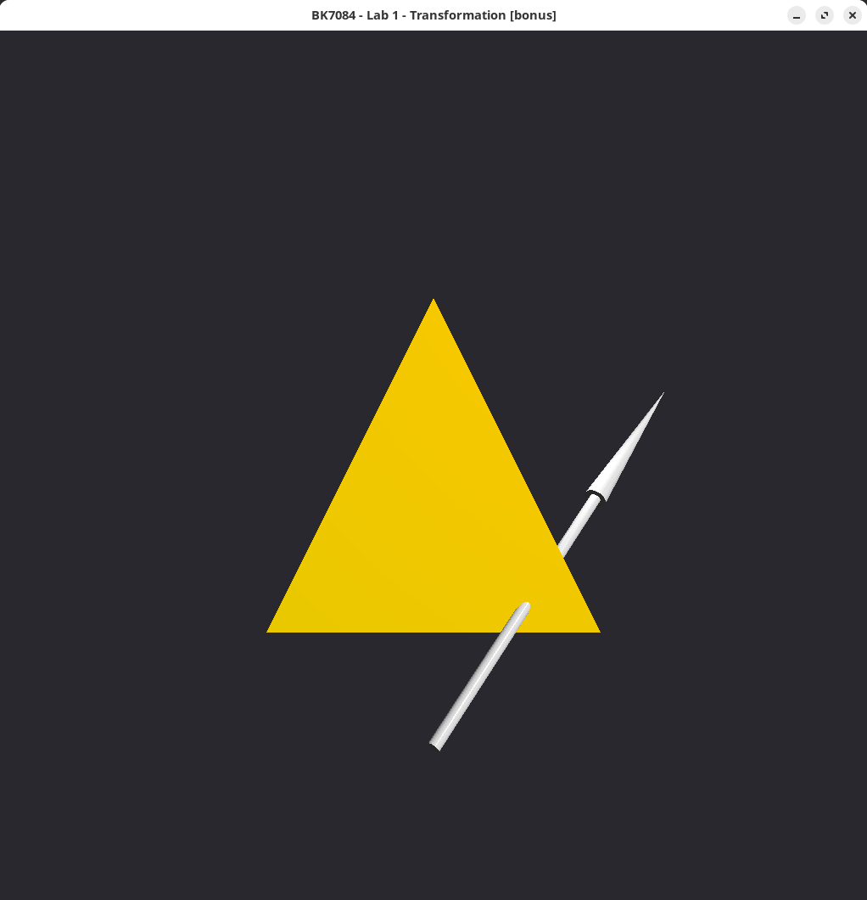

# Assignment 1
In this assignment, we will dive into transformations. It’s
important that you get how to apply transformations to objects in 3D
scenes and how to compose transformations, as you will use these
operations a lot in the final assignment of this course. In this
assignment, we slowly build up complexity: first, you will create
transformation matrices from scratch to control a virtual car. Then you
will compose transformation matrices to construct a lamp. Finally, you
can apply these lessons to build an animated solar system. Follow the
comments in *ex01.py* and *ex02.py* to finish the
assignments. You can use this document as a reference. There are
questions in this document. Don’t skip over them, but think about them.
If you can’t answer them, feel free to ask one of the TAs.

# Translation matrices

You have learned about translation matrices and how they can be applied
in order to move points in space. Below you can see how a point is moved
by multiplying with a translation matrix

$$
\begin{bmatrix}
 1 & 0 & 0 & t_x \\
 0 & 1 & 0 & t_y \\
 0 & 0 & 1 & t_z \\
 0 & 0 & 0 & 1 \\
\end{bmatrix}
\begin{bmatrix}
 v_x \\
 v_y \\
 v_z \\
 1
\end{bmatrix} =
\begin{bmatrix}
 v_x + t_x \\
 v_y + t_y \\
 v_z + t_z\\
 1
\end{bmatrix}.
$$

\$\rightarrow\$ Why are we using four dimensions in the matrix and
coordinates of the point?  
\$\rightarrow\$ Can you compute the result yourself?  
\$\rightarrow\$ What would happen to the result if the last entry in the
matrix was a 4?

In the *translate* function you see that we create a matrix *mat* which
will become your translation matrix. You must fill in the rows and
columns of this matrix appropriately to form such a matrix. It starts
off as the identity matrix

$$
\begin{bmatrix}
 1 & 0 & 0 & 0 \\
 0 & 1 & 0 & 0 \\
 0 & 0 & 1 & 0 \\
 0 & 0 & 0 & 1 \\
\end{bmatrix}
$$

# Rotation matrices

We use a rotation matrix to rotate points. In 3D, a point can be rotated
around three possible axes (the x, y and z axes). Therefore, we need
three rotation matrices to support all these rotations.

$$
R_x(\theta) = \begin{bmatrix}
 1 & 0 & 0 \\
 0 & \cos{\theta} & -\sin{\theta} \\
 0 & \sin{\theta} & \cos{\theta} \\
\end{bmatrix}
$$

$$
R_y(\theta) = \begin{bmatrix}
 \cos{\theta} & 0 & \sin{\theta} \\
 0 & 1 & 0 \\
 -\sin{\theta} & 0 & \cos{\theta} \\
\end{bmatrix}
$$

$$
R_z(\theta) = \begin{bmatrix}
 \cos{\theta} & -\sin{\theta} & 0 \\
 \sin{\theta} & \cos{\theta} & 0 \\
 0 & 0 & 1 \\
\end{bmatrix}
$$

# Composing transformations

Let’s say you want to rotate a point and then translate it. You have
created the rotation matrix $\mathbf{R}$ and translation matrix
$\mathbf{T}$. The point you want to transform is called
$\mathbf{p}$. You could first compute the rotation
\\[\mathbf{p}' = \mathbf{Rp}\\] and then the translation
\\[\mathbf{p}'' = \mathbf{Tp}'.\\] Another way to write this is
\\[\mathbf{p}' = \\mathbf{TRp}.\\] You could also first compute the product
of the matrices $\mathbf{T}$ and $\mathbf{R}$ and then multiply the
result with $\mathbf{p}$.

$$
\begin{aligned}
    \mathbf{M} = \mathbf{TR} \\
    \mathbf{p}' = \mathbf{Mp}.
\end{aligned}
$$

This is possible, because matrix products are *associative*, a fancy
word to say that $(\mathbf{AB})\mathbf{C} = \mathbf{A}(\mathbf{BC})$.
You know this property from regular old numbers (we call them
*scalars*). For example, you know that
$(3 \times 4) \times 5 = 3 \times (4 \times 5)$. This is probably so
obvious to you that you never thought about it, but we’ll see that not
all properties of scalars hold for matrices. The associativity property
is nice, because it means we can compose all our transformations into
*one* 4x4 matrix, which is then multiplied with all the points in our
scene.

We already mentioned that matrix multiplications don’t share all
properties of scalars. One such property is *commutativity*.
Commutativity means that you can swap the order of operations and the
result will be the same: $a \times b = b \times a$. Try it out with
numbers: $3 \times 4 = 4 \times 3$.

$\rightarrow$ Why is this true? Hint: Can you think of a picture for
multiplication?

**Matrix multiplications are not commutative**. That means you cannot
change the order of matrices and expect the same result. Try it out
yourself:

$$
\begin{aligned}
    \begin{bmatrix}
     1 & 3  \\
     4 & 2  \\
    \end{bmatrix} 
    \begin{bmatrix}
     20 & 10  \\
     40 & 60  \\
    \end{bmatrix} &= ? \\\\
    \begin{bmatrix}
     20 & 10  \\
     40 & 60  \\
    \end{bmatrix}
    \begin{bmatrix}
     1 & 3  \\
     4 & 2  \\
    \end{bmatrix} 
    &= ?\end{aligned}
$$

$\rightarrow$ What is the difference between first rotating and then
translating and first translating and then rotating?

# Extra

This is an extra assignment in case you are done early with the first assignment. The task is to write a program for a ray-triangle
intersection. This is one of the core tests for many light simulation
algorithms, especially ray-tracing. You can think of the ray as being a
ray of light and the triangle is part of some surface. You want to know
whether the light ray intersects with the surface (i.e. the triangle).

Most of the framework is already implemented for you. When you first run
the exercise you should see a blue triangle with a moving ray (in
green). Your task is to complete the `intersection.py` file. Once it is
correctly implemented, the triangle will change its color to red when
the ray intersects it.

There are three subtasks, all to be completed in
`intersect_ray_triangle`:

1.  Build matrix A and vector b to create a linear system (see next
    page).

2.  Solve the linear system using NumPy’s solve function:
    `np.linalg.solve(A, b)`.

3.  Implement the intersection conditions based on the solution vecto
    (see next page).

## Ray-Triangle intersection

In lecture 1 we saw the following equation:

\\[
  \mathbf{r} + t\mathbf{d} = \mathbf{a} + \beta(\mathbf{b} - \mathbf{a}) + \gamma(\mathbf{c}-\mathbf{a}),
  \label{eq:raytriintersection}
\\]

where the left side defines a point on a
ray and the right side a point on the plane of a triangle. More
specifically:

  - The ray is defined by its origin $\mathbf{r}$ and a direction
    $\mathbf{d}$. The parameter $t$ defines any point along the ray
    by scaling the direction vector.

  - The triangle is defined by three vertices $\mathbf{a}$,
    $\mathbf{b}$, and $\mathbf{c}$ and the parameter $\beta$ and
    $\gamma$ combines the three vertices to define a point on the
    triangle’s plane.

  - When the following conditions for $\beta$ and $\gamma$ are
    satisfied, the point is inside the triangle: 
    \\[\begin{aligned}
    \beta \geq 0, \\
    \gamma \geq 0, \\
    \beta + \gamma \leq 1.\end{aligned}
    \\]

We also saw that Equation
$\eqref{eq:raytriintersection}$ is actually not
*one* equation, but three: one equation for each axis. We can thus
rewrite Equation $\eqref{eq:raytriintersection}$ as:

$$
\begin{aligned}
r_x + td_x &= a_x + \beta(b_x - a_x) + \gamma(c_x-a_x)\\\\
r_y + td_y &= a_y + \beta(b_y - a_y) + \gamma(c_y-a_y)\\\\
r_z + td_z &= a_z + \beta(b_z - a_z) + \gamma(c_z-a_z)
\end{aligned}
$$

The linear system above contains three unknowns: $\beta$, $\gamma$
and $t$. We have a ray and a triangle, and we want to find a point
defined on the plane by the parameters $\beta$, $\gamma$ and the
same point defined by the parameter $t$ from the ray. In other words,
we want to find $\beta$, $\gamma$ and $t$ that will make the left
side of the equations equal the right side. When this happens, we have
found a point that is on the ray and at the same time on the plane of
the triangle.

Linear systems are commonly expressed in a matrix notation as it makes
any computation much simpler. The above equations can then be written
as:

$$
\begin{bmatrix}
 a_x-b_x & a_x - c_x & dx \\
 a_y-b_y & a_y - c_y & dy \\
 a_z-b_z & a_z - c_z & dz
\end{bmatrix}

\begin{bmatrix}
 \beta \\
 \gamma \\
 t
\end{bmatrix} =

\begin{bmatrix}
 a_x - r_x \\
 a_y - r_y \\
 a_z - r_z
\end{bmatrix}
$$

*We encourage you to check this.* Real understanding comes from working
through problems. Try to go from the matrix notation back to the three
equations.

We often write the combination of matrices and vectors as
$\mathbf{Ax} = \mathbf{b}$. This is called a linear system. Here, we
know the elements of $\mathbf{A}$ and $\mathbf{b}$, and we want to
find the solution vector $\mathbf{x}$. For our specific ray-triangle
intersection $\mathbf{x} = [\beta, \gamma, t]^\intercal$. One way to
solve this system is by sweeping the matrix (Gaussian elimination). We
will take a shortcut to find a solution by using NumPy’s solver for
linear system. It’s used as follows: `x = np.linalg.solve(A, b)`.
