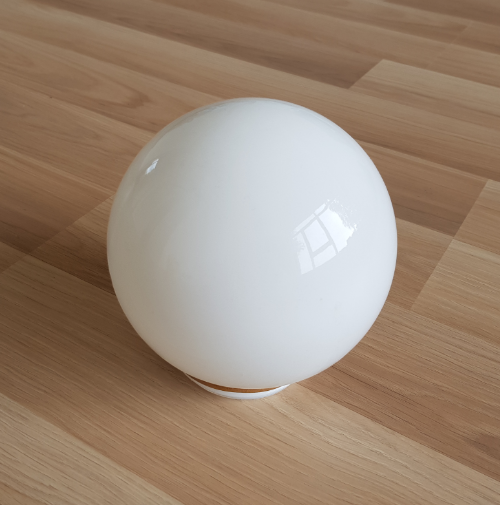

When you first run the program, you will see the outline of the head of
the famous statue of David by Michelangelo, as shown in
Figure [1](#fig:initState). Even though there is a light in the scene,
the object currently does not reflect this light in any way. It is up to
you to specify how David’s head should interact with the incoming light.

Your task in this assignment is to implement various shading functions.
These functions are contained in the file `  ShaderFrag.glsl `. This
file is written in a language called GLSL. This language is somewhat
similar to Python, so you should be able to use your experience from
previous assignments. In the end, the code you will write in GLSL will
be short.  
Why use a different programming language? That’s because the code used
for shading is typically run on your graphics card, instead of your CPU.
The graphics card can run many simple computations at the same time,
where your CPU can only do one at a time for each core (your laptop
likely has 2-8 cores). This is useful when you want to compute color
values for thousands of pixels on your screen. It’s much faster to
compute those all at once (in parallel) than to compute them
one-by-one.  
One important thing to be aware of for this assignment is that you
cannot open and edit the `.glsl` files in the Processing app. We advise
you to open the `.pyde` file in Processing, and open the `.glsl` files
in a text editor (e.g. Notepad). Place the Processing and Notepad window
side by side and edit your program this way.

**Note: GLSL files require a semicolon (;) at the end of every line. If
something goes wrong, first check that every line has a ; at the end\!
More notes on GLSL at the end of this document.**

# Assignment 1

## Ambient lighting

When light hits an object, some of the light is absorbed and some is
reflected. The light that is reflected might hit another object and be
absorbed or reflected again. In this way, the light we see around us
might have bounced from object to object for quite a while before
reaching our eye. When light reaches our eye in such an indirect way, we
call it indirect lighting.  
  
In computer graphics simulating this kind of lighting is one of the
hardest things to get right, but simultaneously one of the most
important factors on a scene’s photo realism.  

Since it is so hard to approximate, old graphics applications used to
make it easy for themselves and just assume all objects are hit by some
constant amount of background light. This is a very crude approximation
and in no way photo-realistic, but it is better than nothing.  

### Your task

As the first step to make the David bust reflect some light, we will do
the same. The file `ShaderFrag.glsl` contains a function called
`Ambient`. It is your task to fill in this function to return a `vec3`
containing the ambient reflection. Therefore, you have to choose an
ambient light intensity (to your taste) and multiply it with the
object’s surface color. Keep in mind that the background light will be
added in addition to all other reflected light, so the final ambient
reflection should be quite dark.

# Assignment 2

## Diffuse Reflection

Diffuse reflection, the reflection of light rays from a surface at many
different angles, is generally modelled in graphics as ideal diffuse
reflection. Ideal diffuse reflection means that the distribution of rays
reflecting off the diffuse material does so uniformly in all directions.
You can see a close approximations of such an ideal diffuse surface when
looking at a plaster wall, or a piece of chalk. Whatever angle you look
at these materials from, the amount of light they reflect seems to be
the same.  
  
In graphics we model this phenomenon with a model named the **Lambertian
Reflectance Model**. This model makes use of **Lambert’s cosine law** to
determine the amount of light reaching a viewer from an ideal diffuse
surface. Lambert’s law states that when looking at such an ideal diffuse
surface, the light intensity reaching your eye from the surface is
proportional to the cosine of the angle between the surface normal
vector and the direction vector from the surface to the light.

As you can see in the above image, the light is most intensely reflected
when the light direction matches up closely with the surface normal. The
bigger the angle between these two vectors, the less light is reflected.
This relationship can be described with the following function:  
  
\(I_D = cos(\theta)\)  
  
Where \(I_D\) is the intensity of the light reflecting off the surface,
and \(\theta\) is the angle between the light direction and the surface
normal.  
  
However, calculating angles and cosines on the graphics card is not a
very cheap operation. Luckily, we know that the dot product between two
vectors is defined as follows:  
  
\(\mathbf{a} \cdot \mathbf{b} = ||\mathbf{a}||\:||\mathbf{b}||\:cos(\theta)\)  
  
Where \(a\) and \(b\) are the two vectors, \(\theta\) is the angle
between them and \(||\mathbf{a}||\) is the length of the vector a.  
  
Now we can use this to reformulate our earlier equation:  
  
\(I_D = \frac{\mathbf{L} \cdot \mathbf{N}}{||\mathbf{L}||\:||\mathbf{N}||}\)  
  
Since a vector divided by its length is just the normalized version of
that vector, we can assume our light and normal vector are normalized
and write the equation as:  
  
\(I_D = \mathbf{\widehat{L}} \cdot \mathbf{\widehat{N}}\)  
  
Where \(L\) is the normalized vector from the surface to the light
source and \(N\) is the surface normal vector.  
  
This is almost the equation for Lambertian Reflectance as well, but we
are not considering the color of the surface and the intensity of the
light yet. If we multiply these factors by the cosine law we obtain the
final equation:  
  
\(I_D = \mathbf{\widehat{L}} \cdot \mathbf{\widehat{N}} C_S I_L\)  
  

### Your task

The file `ShaderFrag.frag` contains a function called `Lambert`. This
function receives two parameters: A `vec3` called N, which is the
normalized surface normal vector, and a `vec3` called L, which is the
normalized light direction vector. It is your task to fill in this
function to return a `vec3` containing the reflected lambertian light
\(I_D\). In addition to the named parameters, you have access to a
variable containing the light intensity `lightDiffuse` and a variable
containing the surface color `passColor`. **Note**: you might want to
clamp the value to 0 if it is less than 0, since it will not have
physical meaning in our current light simulation.  
  

# Assignment 3

## Specular Reflection

Specular reflection is the reflection of light rays in a mirror-like
fashion. The angle between the incoming light direction and the surface
normal is the same as the angle between the reflected light and the
surface normal. The result of this is that light originating from
somewhere else is reflected into your eye by this surface, making it act
like a mirror.  
  
Perfect specular reflectors are hard to find though. Mirrors definitely
come closest. Usually, materials reflect light in some combination of
diffuse and specular reflection. In the photo below, you see such a
situation. Usually the the object looks fairly diffuse, but has a bright
spot where the intense light is reflected specularly.  

In computer graphics, this phenomenon has many possible approximations.
The first one, of interest to you, was proposed by Bui Tuong Phong, and
is called Phong Reflection. It is a reflection model that tries to
approximate this bright spot you often get when a light source shines on
some shiny surface. The shinier the surface, the more intense and sharp
these specular highlights will be, the duller the surface, the more
gradually these highlights fade away.

The formula for Phong reflection is mostly empirical, but there is logic
to it. In order to get an intense reflection of light it tries to
minimize the angle difference between the direction from the surface to
the observer, and the perfectly reflected light direction. If these
match up closely, then the observer sees a lot of the light that follows
this perfect reflection direction. This relationship can be modelled
as:  
  
\(I_S = \mathbf{\widehat{V}} \cdot \mathbf{\widehat{R}}\)  
  
Where \(I_S\) is the intensity of the specular light reaching the
observer, \(\mathbf{\widehat{V}}\) is the normalized direction from the
surface to the observer and \(\mathbf{\widehat{R}}\) is the perfect
reflection direction.  
  
The equation to calculate the perfect reflection direction is usually
stated in one of two ways, depending on if the light direction vector is
pointing towards the surface or toward the light.  
  
\(\mathbf{R} = 2 \mathbf{N}(\mathbf{N} \cdot \mathbf{L}) - \mathbf{L}\)  
  
Where \(\mathbf{R}\) is the perfect reflection direction, \(\mathbf{N}\)
is the surface normal, \(\mathbf{L}\) is the direction from the surface
to the light, and all of these vectors are normalized. If the vector
\(\mathbf{L}\) is instead pointing towards the surface the equation
becomes:  
  
\(\mathbf{R} = \mathbf{L} - 2 \mathbf{N}(\mathbf{N} \cdot \mathbf{L})\)  
  
In order to make the specular highlight smaller and sharper the closer
the viewer is to the perfect reflection angle, Phong exaggerates the
earlier formula, by taking it to the power of some **shininess** factor
**n**.  
  
\(I_S = (\mathbf{\widehat{V}} \cdot \mathbf{\widehat{R}})^n\)  
  
Again we have to account for the color of the surface and the intensity
of the incoming light, and we arrive at the final formula:  
  
\(I_S = (\mathbf{\widehat{V}} \cdot \mathbf{\widehat{R}})^n C_S I_L\)  
  

### Your task

The file `ShaderFrag.frag` contains a function called `Phong`. This
function receives three parameters: A `vec3` called N, which is the
normalized surface normal vector, a `vec3` called L, which is the
normalized light direction vector (from the surface to the light) and V
which is the normalized direction vector from the surface to the
observer. It is your task to fill in this function to return a `vec3`
containing the reflected specular light \(I_S\). In addition to the
named parameters, you have access to a variable containing the light
intensity `lightSpecular` and a variable containing the surface color
`passColor`.  
  
Please note that you also need to check whether the pixel is visible or
not. If it is invisible, then you need to set the value to be zero.  

  
If all 3 parts of the shader are implemented properly, your result will
be similar to Figure [2](#fig:FinalResult)

### Bonus task

A more stable and performant algorithm to approximate these specular
highlights was proposed by Jim Blinn. This modification to the Phong
algorithm is named the Blinn-Phong shading model. On Wikipedia look up
what alterations Jim made to the algorithm and change your Phong
implementation to incorporate these changes.

# GLSL Language

Shaders (vertex and fragment shaders in our case) are written in the
C-like language, callsed GLSL. GLSL is tailored for use
with graphics and it has useful features specifically built for vector
and matrix manipulation.

Below are some functionalities that you might need to refer while
finishing **Assignment 3**.

|                                    |                                                                            |
| :--------------------------------- | :------------------------------------------------------------------------- |
| **Syntax**                         | **Functionality**                                                          |
| `vec3(0); or vec3(1.0, 0.3, 0.3);` | To construct a vector with 3 elements                                      |
| `v = vectorA * vectorB`;           | To multiply (element-wise) two vectors.                                    |
| `v = vectorA + vectorB`;           | To add two vectors `vectorA` and `vectorB` and store it in vector `v`      |
| `v = vectorA - vectorB`;           | To substract `vectorB` from `vectorA`.                                     |
| `dot(A,B)`;                        | To perform dot product of vector `A` and `B` (return a scalar)             |
| `max(a,b)`;                        | To pick the maximum of two values a and b                                  |
| `pow(a,n)`;                        | To compute the power of a by a factor of n (\(a^n\))                       |
| `light.xyz`;                       | To access the first 3 entries of vector `light` (possibly has 3-4 entries) |
| `normalize(vectorA)`;              | To normalize `vectorA`                                                     |

**Note**: make sure that you terminate every line of code in GLSL with a
semicolon (*i.e.*`;`).
