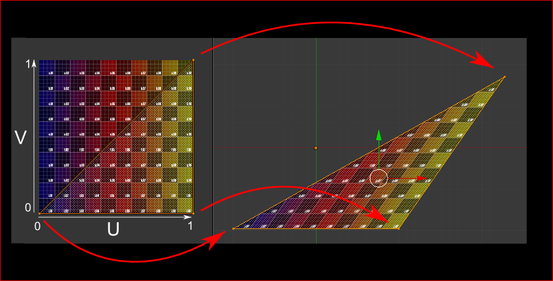

# Final Project, part 1: Procedural Building Generation

In your final project your task will be to procedurally generate a city
and optimise its layout to become a city where people would like to
live. For the first part of the final project you will write a program
that procedurally generates the buildings which will eventually populate
your city.

In the file *buildings.py* you will find three classes called
*Skyscraper*, *Highrise* and *Office*, which are the main types of
buildings in the city. They have the following initialisation
parameters:

  - *num\_floors* - The number of floors of your building

  - *max\_width* - The maximum width of your building in units.

It is up to you to complete these classes to generate each building.
Design your own building for each class, using the knowledge from the
past assignments. Feel free to experiment with different settings and
add parameters that you like. You don’t specifically have to make a
skyscraper, highrise or office if you have other plans for cool buildings.
Just make sure you have buildings with three distinct heights.

We have created a basic *Skyscraper* class, which stacks a number of
cube-like floors. Each floor consists of four walls and two floor
components. Such components are defined in the file *components.py*.
Take a look at the class *BasicWall* and follow the comments to
understand how it works. We have also set up *BasicWindowWall* and *BasicFloor* 
to get you started. You are free to add your own components to create just
the geometry that you want (triangles, circles, cylinders, anything).

## Creating a building

The buildings in *buildings.py* are simply collections of components
that you add by calling *app.add_mesh()*. When you add a component to a
building, you can set the parent of a component. A component inherits
the transformations that are applied to its parent. This is helpful if
you want to define transformations relative to other components. For
example, we would like to parent the walls to the floor, so that when we
move a floor upwards, the walls move up as well.

Using the tools listed above you can already create some fancy buildings
with curves and twists. You can also use randomness to create some
variation in your building. We have already imported the *randint()* and
*rand()* functions from NumPy for you. Try to be as creative as
possible, as this will count towards your final project grade\!

# Texturing

Once you’ve started to generate some buildings, it is time to make them
look better. We’ll use textures (images ‘glued’ onto your models) to add
some personality to your buildings. Textures are placed onto your
triangles by setting the location of each triangle vertex in the vertex.
These should be given when you create a mesh component. The *BasicWall*
class in *components.py* shows you how to set texture coordinates for
each vertex. There’s also a class *BasicWindowWall*, which uses a *SubMesh*
to set different textures for some triangles in the mesh. Look at the
code in *WindowWall* to see how it works. We’ve provided some basic
textures as part of the assignment. You are encouraged to create and use
your own textures.

Remember from the lectures that texture coordinates (or UV-coordinates)
signify where the vertices of your triangles end up on the texture. A
texture coordinate of (0, 0) corresponds to the bottom-left of your
texture, and a coordinate of (1, 1) corresponds to the top-right of your
texture.

