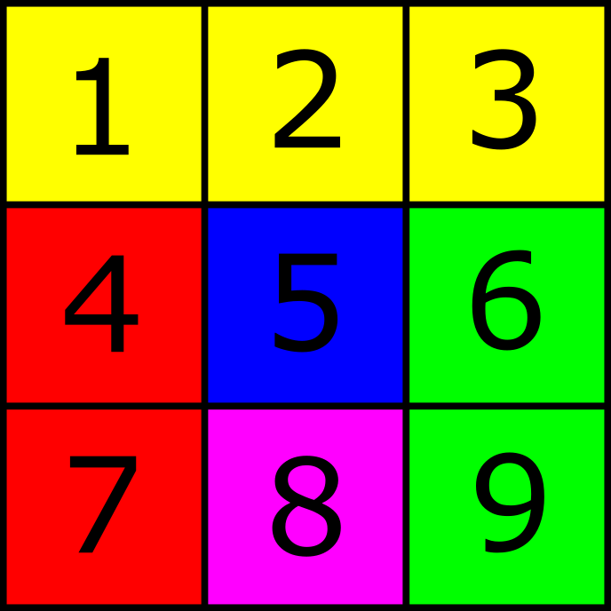
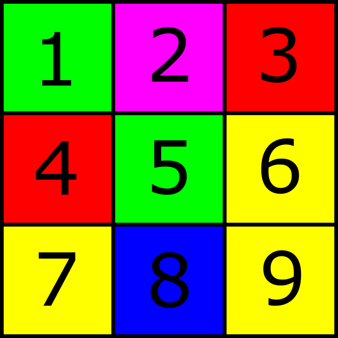
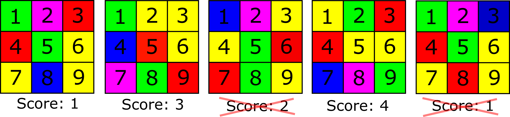

# Advanced optimization

In iterative optimization we attempt to approximate a solution to a
problem by making an initial guess and improving this guess over the
iterations. In order to improve on such a guess we need a measure of how
close our approximation is to the actual optimal solution.  
  

# Example

Imagine we were trying to computationally generate the following layout
of colors over the grid cells (1-9).

It is a simple problem, because we know exactly how the colors should be
laid out to achieve this solution. However, the solution isn’t always
this obvious. And so we will try to come to this solution through
iterative optimization instead.  

## Random guess

The first step to solving this algorithmically is to simply choose a
random layout of colors.  

How good is this random guess? How close is it to the optimal layout?
Let’s set up some rules for how correct a layout is, for example:  

1.  Yellow colors want to be in the top row

2.  The purple color wants to be on the bottom row

3.  Red colors want to be on the left

4.  Green colors want to be on the right

5.  The blue color wants to be in the middle

A layout that follows these rules more closely than another layout is a
better layout. In order to measure this ’correctness’ we can give scores
to a layout. The higher the score the more closely it follows the rules
we have set up.

## Scoring

If we give 1 point for every grid cell that follows each of the rules we
would score our initial guess as such:  

1.  Yellow colors want to be in the top row (0 out of 3 points)

2.  The purple color wants to be on the bottom row (0 out of 1 points)

3.  Red colors want to be on the left (1 out of 2 points)

4.  Green colors want to be on the right (0 out of 2 points)

5.  The blue color wants to be in the middle (0 out of 1 points)

If we add up all these scores that gives our initial guess a total score
of 1, pretty bad. Let’s try improving on that.

## Iterating

A naive way of improving the layout would be to generate a completely
new grid and compute its score again. If the score is higher than the
last layout, we will keep this new grid. If the score isn’t higher then
we will keep the previous layout.  
  
The longer you let this algorithm generate random layouts the greater
the chance that your layout approaches the optimal solution shown in
Figure 1. Observe the following progression:  

It starts with a random layout with a score of 1, then a new layout is
generated that has a score of 3. We keep this new layout, since the
score is higher than our previous one. Now we generate another layout,
but this time the score is lower than our previous score and so we
discard it.  
  
On the next layout we get a score of 4, so this is now our best
approximation. The layout after it has a score lower than 4 so again we
discard it.  
  
It will obviously take a while for this naive method to converge to the
correct solution, and it would need to randomly generate the correct
solution by pure chance, and then we would accept it.

### Another method

Another naive method that is closer to a smarter solution is that
instead of generating a completely random grid every iteration, we swap
two tiles in our existing grid.  
  
That is, we randomly pick two locations in the grid and swap their
colors. Now we compute whether this new configuration of colors is
better than before we swapped those two tiles. If it is, then we keep
the tiles as they are now, if it isn’t, then we swap the tiles back to
their original position.

### A non-naive method

In the last method we randomly swapped some tiles with no regard as to
how correct those tiles were. Also we didn’t take into account any
history of swapping. As a consequence it might happen that we swap tiles
that were in their perfect positions already. We obviously discard such
a change as that would impact the score negatively, but essentially it
is a wasted iteration.  
  
A smarter way of swapping would be to look at which tiles were producing
a low positive impact on the overall score. For if these tiles don’t
impact the score very positively, they are probably not in the place
they want to be in.  
  
Another improvement would be to keep track of the immediate history of
swaps that we have attempted. It makes no sense to swap the same tiles
we just attempted to swap on the previous iteration.  
  
There are a lot of clever tricks to think of in order to have less
wasted iterations and move towards a solution quicker.
