# Introduction

Welcome to the BK7084-Computational Simulation. This is a tutorial to
help you setup the Python programming environment so that you can jump
right into the practical courses.

# Coding Environment Setup

## Install a Python interpreter

To run a Python program, you need something called an _interpreter_. This is a piece of software that runs each command in your code. Python is pre-installed on macOS and Linux, while Windows users must
manually install it. You can have multiple installations of Python on the same machine, just like you can have different versions of Microsoft Office or Adobe Photoshop. To manage all these installations and make sure we use the right one, we'll use the Python environment manager [Anaconda](https://www.anaconda.com/) to install Python.

### Install mini-anaconda

Installation files for Windows, macOS and Linux can be found at:
<https://docs.anaconda.com/miniconda/>

## Install Visual Studio Code and the Python Extension

### Visual Studio Code

Go to <https://code.visualstudio.com/Download> and download the
corresponding installer for your system.

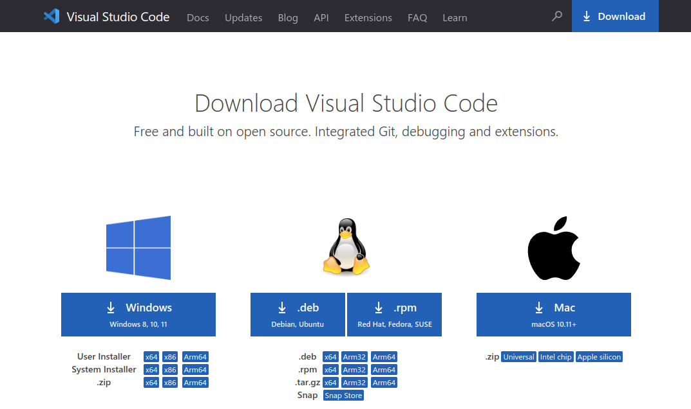

Once the Visual Studio Code editor is installed, install the Python
extension. Open your Visual Studio Code, and search python in
**Extensions** tab.

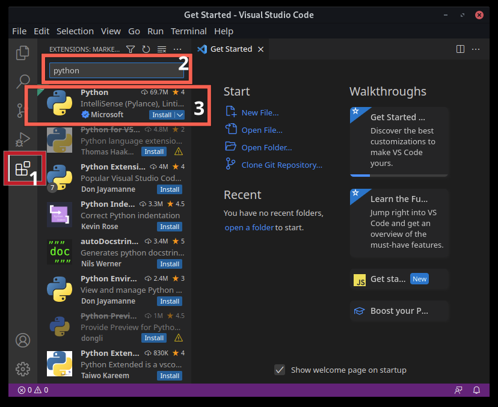

### Start VS Code in a project folder

Create an empty folder called *hello*, and open the folder from VS Code:
**Menu** \> **File** \> **Open Folder...**

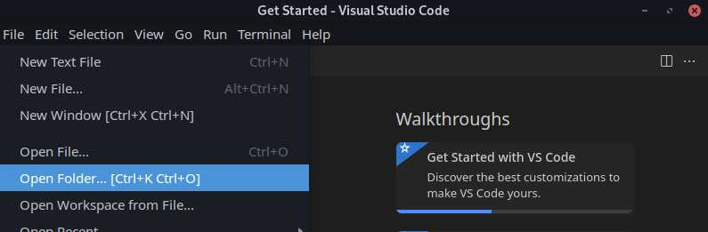

From the File Explorer toolbar, select the **New File** button on the
`hello` folder:

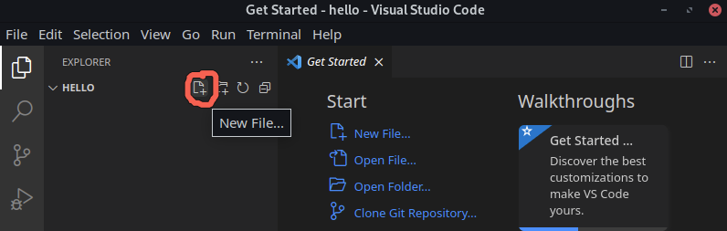

Name the file **hello.py**, and it automatically opens in the editor:

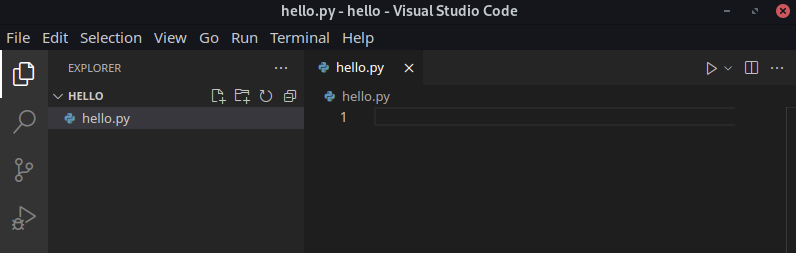

Enter the following source code in **hello.py**:

``` python
print("Hello World")
```

# Conda environment

Using the terminal, create a new environment with Python 3.9 installed.
You don't have to type the `$`. It's used to show that you should run a line in the terminal.
$ conda create -n compsim python=3.9


Before we run it, we need to select a Python interpreter: within VSCode,
open the **Command Palette** (*Ctrl+Shift+P*), and then type **Python:
Select Interpreter** command to search, then select the command. The
command presents a list of available interpreters that VS Code can find
automatically, you should be able to see **compsim**, the environment
we just created. Click to choose it. If you don’t see the name
**compsim** run the command|:

``` bash
$ conda activate compsim
```

You will need to run this command every time you open VSCode.

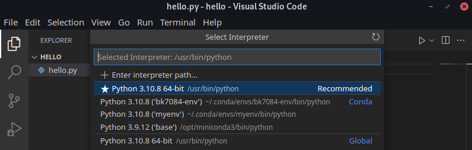

Now you can run the script by simply clicking the **Run Python File in
Terminal** play button in the top-right side of the editor.

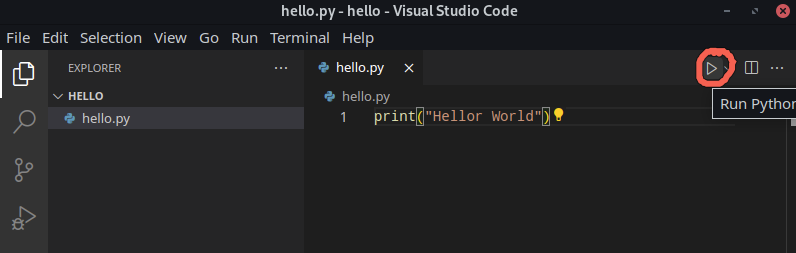

The button opens the terminal panel in which your Python interpreter is
automatically activated, then runs `python hello.py`.

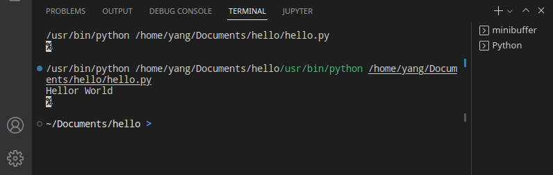

As you can see, the **Hello World** is successfully printed on the
screen in the terminal.

# Assignments Setup

To get your assignments, click the **Download assignments** button at the top of the page or go to <https://github.com/bk7084/assignments>,
click **Code** then **Download ZIP**.

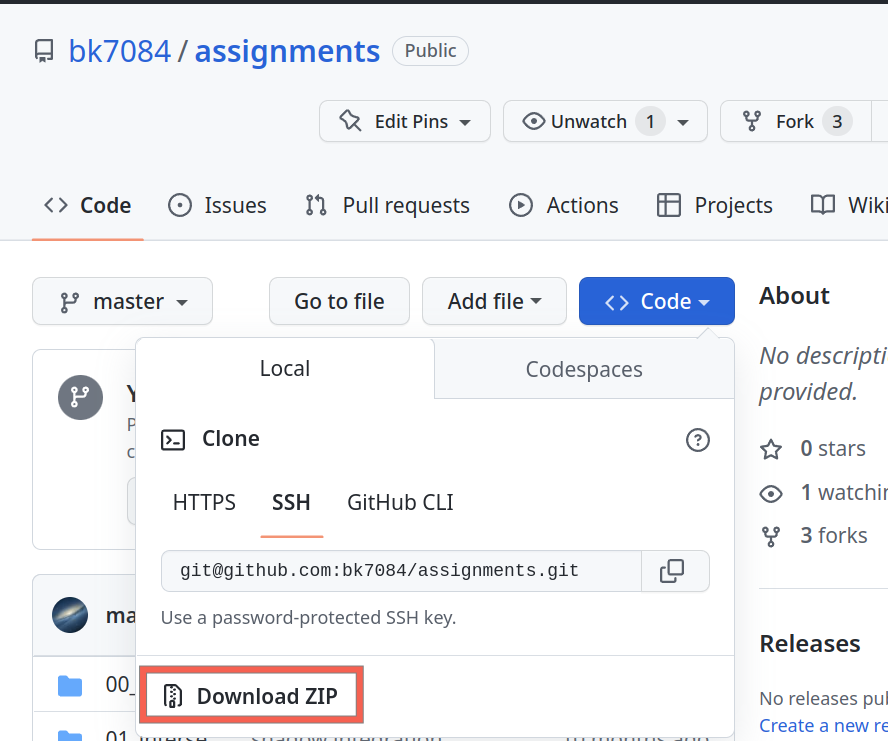

Extract the zip file to your preferred location. Open the folder
**00\_introduction** in VS Code, then open the file **intro.py**. You can
try to run the file by clicking the **Run Python File** on top-right.
Your terminal probably gives the following error:
*ModuleNotFoundError: No module named ’bk7084’*

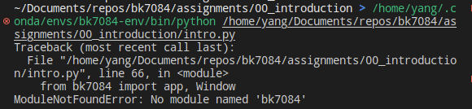

So, what exactly is a Python module? Simply put, a module is a Python
file that contains definitions of functions, classes, and variables. In
our case, it means that we need to install this module or package named
**bk7084**.

If you have not done so yet, activate **compsim** using

``` bash
conda activate compsim
```

type the following command to install the missing **bk7084** module

``` bash
pip install bk7084
```

***pip*** is the standard package manager for Python. It allows you to
install and manage additional packages that are not part of the Python
standard library.

Once the installation is finished, try again to run the **intro.py**,
you should have a window with a brownish triangle drawn above like this:

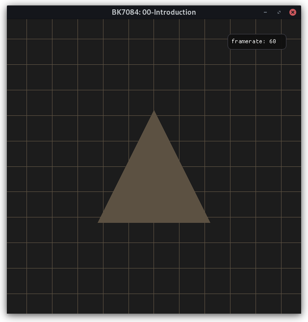

Congratulations\! You now have a Python environment with the necessary
packages to run all the exercises. Now go ahead and try the exercises inside **intro.py**.
