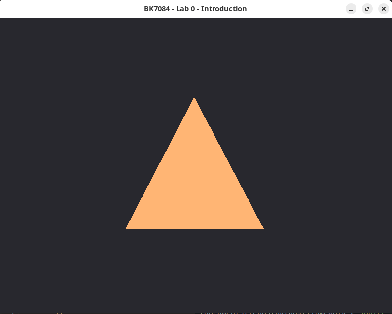

# Introduction

Welcome to the BK7084-Computational Simulation. This is a tutorial to
help you setup the Python programming environment so that you can jump
right into the practical courses. To learn more about python, please
follow any of the programming tutorials on python.org:
<https://wiki.python.org/moin/BeginnersGuide/Programmers>

# Coding Environment Setup

## Install a Python interpreter

Python is pre-installed on macOS and Linux, while Windows users must
manually install it. Installing the most recent version will give you
access to the newest features. Different Python interpreters can be
installed on the same machine at the same time. To make things easier to
manage, we use a Python environment manager [Anaconda](https://www.anaconda.com/) 
to install Python.

### Install mini-anaconda

#### Windows

  
Step 1: download the latest Miniconda installer for Windows 64-bit from
<https://docs.conda.io/en/latest/miniconda.html#latest-miniconda-installer-links>.

Step 2: Double-click the `.exe` file.

Step 3: Follow the instructions on the screen. If you are unsure about
any setting, accept the defaults. You can always change them later. When
the installation is complete, launch the Anaconda Prompt from the
**Start** menu.

Step 4: To test your installation. Run the `conda list` command from
your Anaconda prompt. A list of installed packages appears if it has
been installed correctly.

#### macOS

  
Enter your terminal, then follow the steps:

Step 1: Download the latest shell script according to your processor’s
architecture (Intel or Apple M1) from
<https://docs.conda.io/en/latest/miniconda.html#latest-miniconda-installer-links>.

Step 2: Double-click the downloaded installer and then follow the
instructions on the screen.

Step 3: Test your installation. Run the `conda list` command from your
Anaconda prompt. A list of installed packages appears if it has been
installed correctly.

#### Linux

  
Enter your terminal, then follow the steps:

Step 1: Download the latest shell script

```shell
$ wget -c https://repo.anaconda.com/miniconda/Miniconda3-latest-Linux-x86_64.sh
```

Step 2: Run the installation script then follow the instructions on the
screen

``` shell
$ sh ./Miniconda3-latest-Linux-x86_64.sh
```

Step 3: To test your installation. In your terminal, run the command
`conda list`. A list of installed packages appears if it has been
installed correctly.

### Create a new Python environment

After the installation of mini-anaconda, next step will be creating a
Python environment for running Python code. An environment contains the
Python interpreter and some other necessary Python packages.

Inside of your terminal or Anaconda Prompt (on Windows) run the
following command:

``` shell
$ conda create --name bk7084-env
```

This will create a environment named as **`bk7084-env`**. Of course you
can name it whatever you want. Later we will install some packages
inside of this environment. Right after the creation, you can activate
this environment use

``` shell
$ conda activate bk7084-env
```

To test if everything works well, try enter `python` after activation of
the environment. You should be able to see a python interpreter popped
up:


## Install Visual Studio Code and the Python Extension

### Visual Studio Code

Go to <https://code.visualstudio.com/Download> and download the
corresponding installer for your system.


Once the Visual Studio Code editor is installed, install the Python
extension. Open your Visual Studio Code, and search python in
**Extensions** tab.


### Start VS Code in a project folder

Create an empty folder called *hello*, and open the folder from VS Code:
**Menu** \> **File** \> **Open Folder...**


From the File Explorer toolbar, select the **New File** button on the
`hello` folder:


Name the file **hello.py**, and it automatically opens in the editor:


Enter the following source code in **hello.py**:

``` python
print("Hello World")
```

Before we run it, we need to select a Python interpreter: within VSCode,
open the **Command Palette** (*Ctrl+Shift+P*), and then type **Python:
Select Interpreter** command to search, then select the command. The
command presents a list of available interpreters that VS Code can find
automatically, you should be able to see **bk7084-env**, the environment
we just created. Click to choose it. If you don’t see the name
**bk7084-env**, close VS Code, open Ananconda-Prompt then run command

``` bash
$ conda activate bk7084-env
```

and reopen the VS Code, you should now be able to choose the environment
that we created.


Now you can run the script by simply click the **Run Python File in
Terminal** play button in the top-right side of the editor.


The button opens terminal panel in which your Python interpreter is
automatically activated, then runs `python hello.py`.


As you can see, the **Hello World** is successfully printed on the
screen in terminal.

# Assignments Setup

To get your assignments, go to <https://github.com/bk7084/assignments>,
click **Code** then **Download ZIP**.


Extract the zip file to your preferred location. Open the folder
**00\_introduction** in VS Code, then open the file **into.py**. You can
try to run the file by clicking the **Run Python File** on top-right.
Your terminal probably gives the same error as mine:
*ModuleNotFoundError: No module named ’bk7084’*


So, what exactly is a Python module? Simply put, a module is a python
file that contains definitions of functions, classes, and variables. In
our case, it means that we need to install this module or package named
**bk7084**.

Open Anaconda-Prompt, then activate **bk7084-env** using

``` bash
$ conda activate bk7084-env
```

type the following command to install the missing **bk7084** module

``` bash
$ pip install bk7084
```

***pip*** is the standard package manager for Python. It allows you to
install and manage additional packages that are not part of the Python
standard library.

Once the installation is finished, try again to run the **intro.py**,
you should have a window with a brownish triangle drawn above like this:



Congratulations\! You now have a Python environment with necessary
packages to run all the exercises. Continue read the text inside
**intro.py** and finish the exercise.
